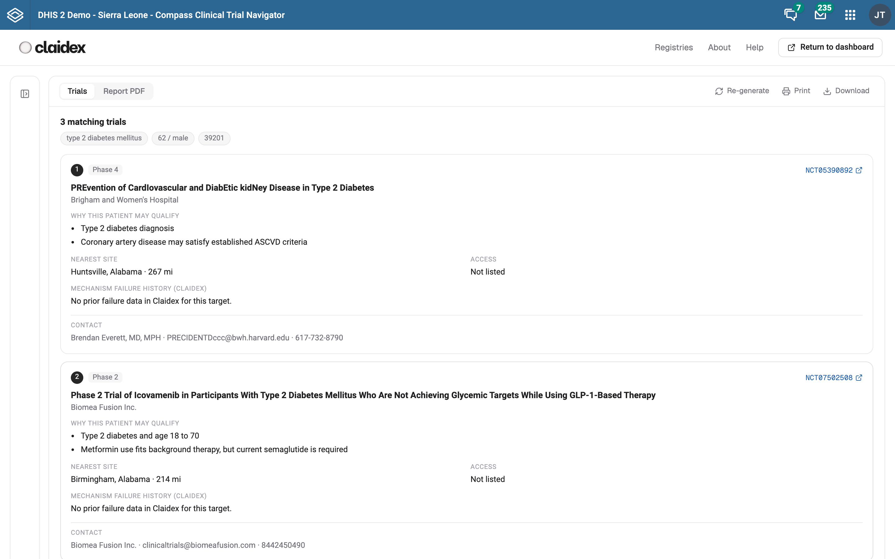

<div align="center">
  
  <h1>Compass for DHIS2</h1>
  <p><b>AI clinical trial navigation, built for health systems.</b></p>
  <p>
    <a href="LICENSE"></a>
    
    
  </p>
  
</div>

## Overview

Compass is a DHIS2 application from [Claidex](https://app.claidex.com). Describe a
patient in plain language and Compass finds matching clinical trials from
official registries, explains why each may fit, surfaces historical
mechanism-failure context, and produces a clean, fillable PDF report. It runs
inside DHIS2 and works on modest devices and networks.

## Features

- **Registry search.** A built-in search that runs entirely in the browser
  against ClinicalTrials.gov and ISRCTN. Useful for referral, patient education,
  and research, and it works with no external service.
- **AI Patient Navigator.** An optional streaming assistant turns a
  plain-language description into a trial search with eligibility reasoning,
  logistics, and historical mechanism-failure context.
- **Trial report.** Matched trials as structured cards plus a downloadable,
  print-ready PDF with a pre-filled profile and per-trial detail.
- **Works with or without the AI.** If the AI service is unavailable, the app
  stays fully usable through Registry search and the registry directory.
- **Registry directory.** Deep links to every WHO primary registry worldwide.
- **Privacy first.** No patient data is stored or logged. Registry search sends
  only search terms to public registries; the session clears when the tab
  closes and reports never leave the browser.

## Quick start

```bash
npm install
npm start          # DHIS2 app shell on http://localhost:3000
npm run build      # production bundle in build/ (+ zip in build/bundle)
```

To develop against a running DHIS2 instance without CORS friction, use the proxy
pattern:

```bash
npm start -- --proxy https://play.im.dhis2.org/dev   # Server = http://localhost:8080
```

## Configuration

Copy `.env.example` to `.env`. All variables are optional.

| Variable | Purpose |
| --- | --- |
| `REACT_APP_COMPASS_API_BASE` | Claidex Compass API powering the AI navigator. Defaults to `https://app.claidex.com`. |

The AI and its tools run on the Claidex Compass service; no model key is embedded
in this app. The Compass endpoint must allow this app's origin via CORS.

## Privacy and safety

Compass is informational decision support, not a diagnostic or treatment tool,
and it does not replace the official registry record or clinical judgement. The
patient description you type is sent to the Claidex Compass API to find trials
and build the report; that service is stateless and stores no patient data. The
app writes nothing to the DHIS2 datastore.

## License

[BSD-3-Clause](LICENSE). A Claidex product.
